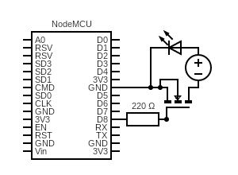
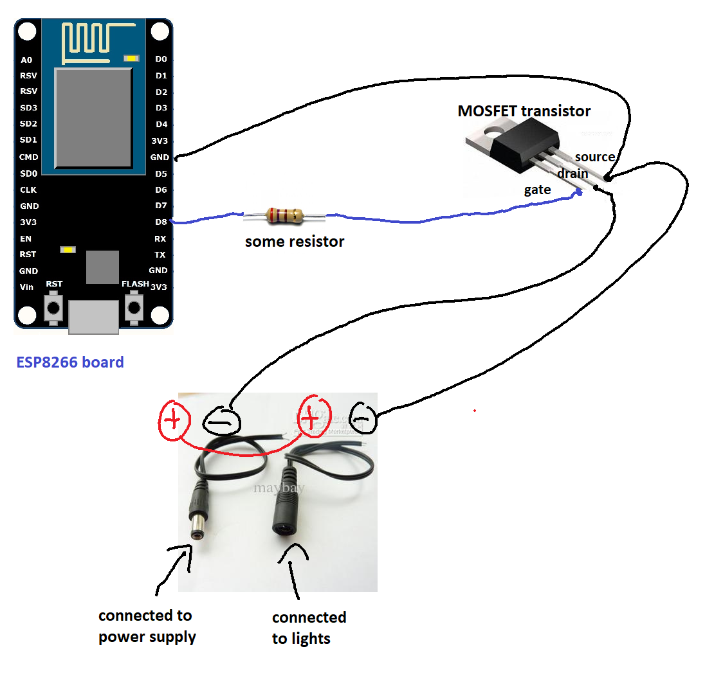

# lights
Controlling [LED string lights](https://www.amazon.com/s?k=led+string+lights&ref=nb_sb_noss_1) through IoT. 


### Physical circuit

**You will need:**
* **LED string lights** I bought mine on ebay.
* **WiFi Arduino board** The one I used is the ESP8266 ($12 for 2). Look up "WiFi board" on amazon. 
* **MOSFET Transistor** Acts as a controllable resistor
* **Resistor** I used a 220 ohm resistor. 

**Circuit diagram:**
<br>

<br>

Or if you can't read circuit diagrams like me:
<br>

<br>


### Installation
Clone repo
```
cd ~/
git clone https://github.com/andrewhu/lights.git
cd lights
```
Install dependencies
```
sudo apt-get update
sudo apt-get install python3 python3-venv
```
Setup virtual environment
```
python3 -m venv venv
. venv/bin/activate
pip install -r requirements.txt
```
Create systemd unit file
```
sudo cp _setup/lights.service /etc/systemd/system/
```
Start lights service
```
sudo systemctl start lights
```
Enable lights service on bootup
```
sudo systemctl enable lights
```
Nginx configuration
```
server {
    listen 5000;
    listen [::]:5000;

    server_name _;

    location / {
        include proxy_params;
        proxy_pass http://unix:/home/andrew/lights/lights.sock;
    }

}

```


